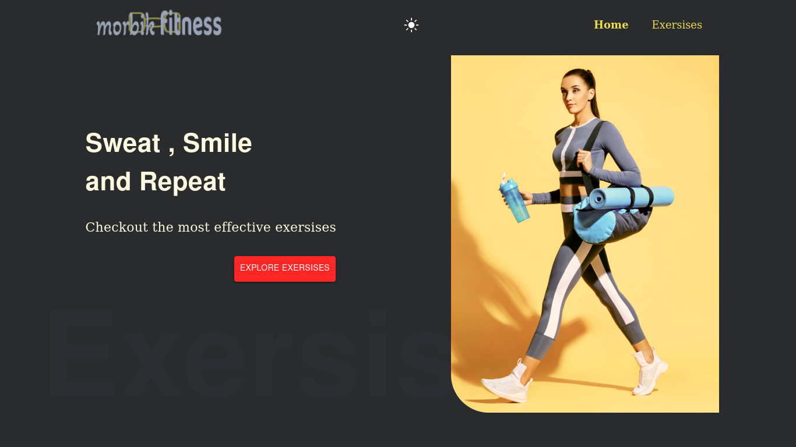
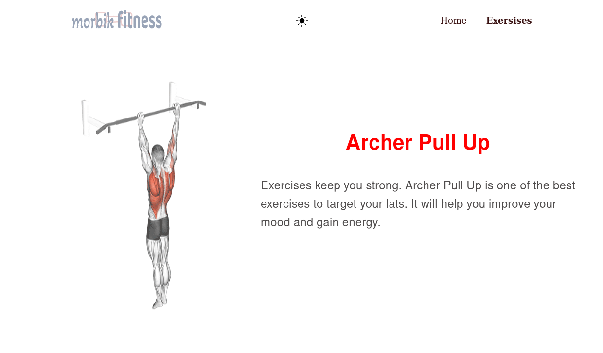

# Morbik Fitness

This project utilized exerciseDB api from rapid api to show different exercises. The exercises can be filtered and searched by different body parts. It also suggests d/t youtube videos that are similar to the current exercise by using the Youtube Search and Download api, also found in rapid api.

 
    

### Built using
<code>#reactjs #css3 #api #material ui #netlify</code>

 

## Project Screenshots

 
 

<table>
    <tr>
        <td >
          
        </td>
        <td>
          
        </td>
    </tr>
     <tr>
        <td>
          
        </td>
        <td>
          
        </td>
    </tr>
</table>
 

 

<a href="https://morbik-fitness.netlify.app/" > Go to project </a>

